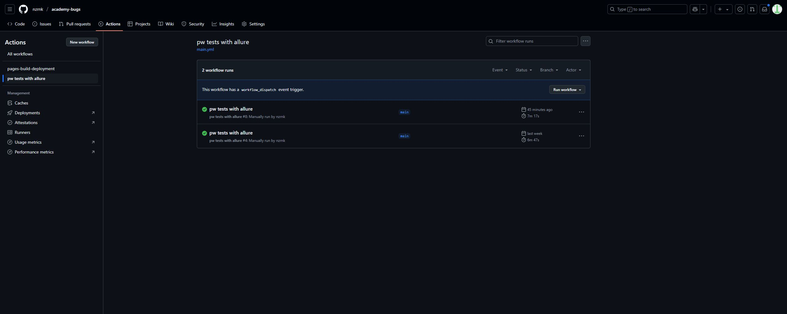
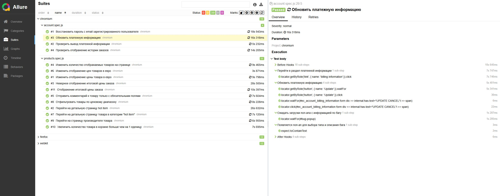

## Репозиторий для проекта AcademyBugs.com
---
## Содержание
- [Описание](#Описание)
- [Стек](#Стек)
- [Тест-кейсы](#Тест-кейсы)
- [Запуск тестов и генерация отчетов](#Запуск-тестов-и-генерация-отчетов)
- [Запуск workflow в GitHub Actions](#Запуск-workflow-в-Github-Actions)
- [Пример Allure отчета](#Пример-Allure-отчета)


---
## Описание
Данный репозиторий содержит набор e2e тестов для проекта AcademyBugs.com. На сайте находится раздел для поиска багов https://academybugs.com/find-bugs/.

Тест кейсы в данном репозитории проверяют различные аспекты данного раздела. В качестве ассертов используется не целевая проверка самого теста а именно тот факт, что в результате будет получена ошибка.

---


## Стек


Тесты для данного проекта написаны с использованием JS + Playwright, для CI/CD используется Github Actions, генерация отчетов в Allure.

---
## Тест-кейсы

- [x] Восстановить пароль c email зарегистрированного пользователя
- [x] Проверить вывод платежной информации
- [x] Обновить платежную информацию
- [x] Проверить отображение истории заказов
- [x] Изменить количество отображаемых товаров на странице
- [x] Отправить комментарий к товару только с обязательными полями
- [x] Изменить отображение цен товаров в евро
- [x] Перейти на детальную страницу товара в категории "hot item"
- [x] Отфильтровать товары по ценовому диапазону
- [x] Перейти на страницу производителя товара
- [x] Увеличить количество товара в корзине больше чем на 1 еденицу
- [x] Отображение итоговой цены заказа

---
## Запуск тестов и генерация отчетов

Команда для локального запуска тестов

```
npm run test`
```
Команда для локального формирования отчета

```
npm run create report
npm run open report
```
---
## Запуск [workflow в GitHub Actions](https://github.com/nzrnk/academy-bugs/actions/workflows/main.yml)

Workflow настроен на ручной запуск через Github Actions. Для этого нужно перейти в раздел Actions в репозитории, выбрать нужный workflow и нажать "Run workflow".



---
## Пример [Allure отчета](https://nzrnk.github.io/academy-bugs/)
<!-- -->


